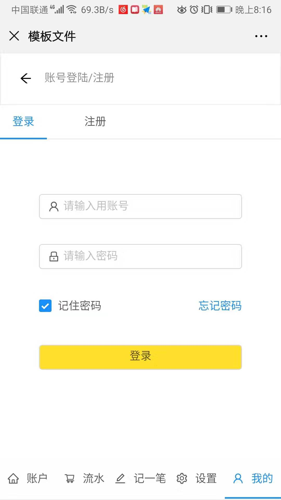
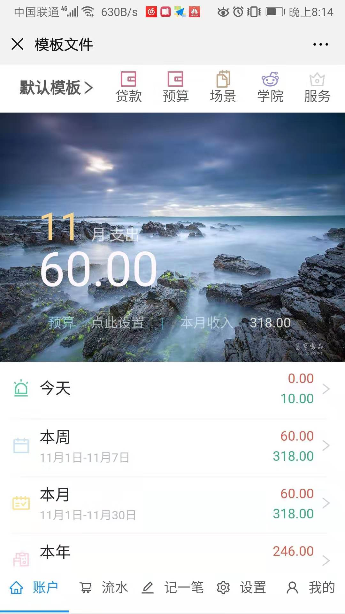
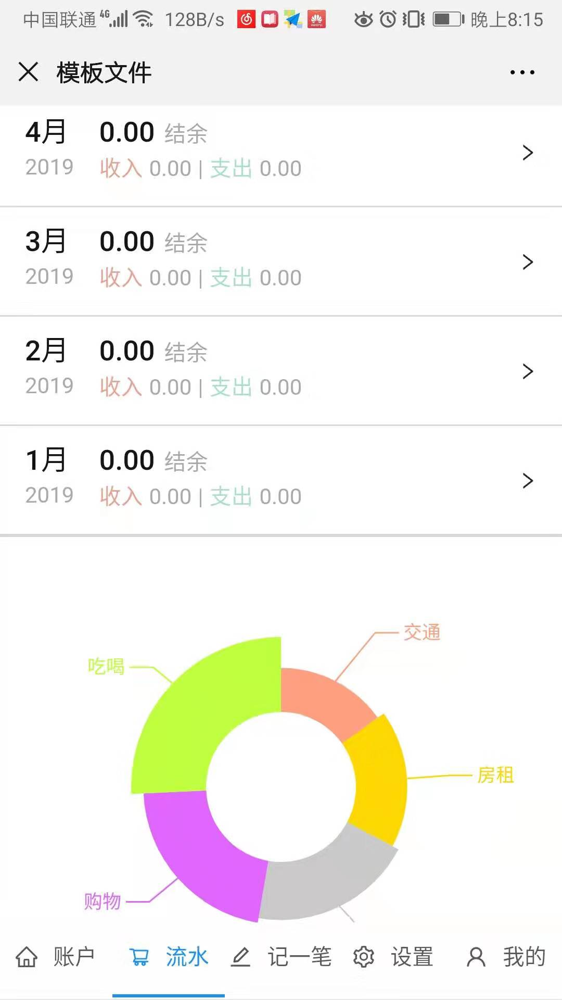
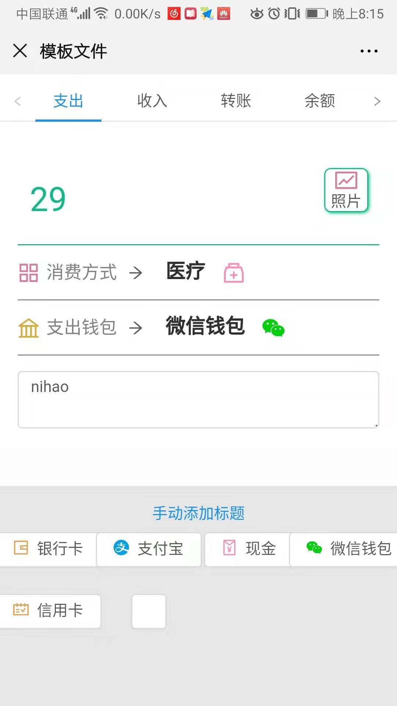

## 项目名称：随手记
* 演示
	* 官网地址：(https://www.sui.com/)
	* 上线网址：(http://116.62.5.240)
	* 客户端账号：laoyao 密码:123456
* git仓库地址：
* 团队与分工
    * 格式：组长：覃宁，成员:张晓旭，龙利成
    * 负责模块说明
		* 覃宁：后端和“记一笔”模块
		* 张晓旭：“账户”和“流水”模块
		* 龙利成：“登录注册”和“我的”模块
* 项目页面截图

* 项目目录说明
src
    │  App.js-------------------------------------------------------主页
    │
    ├─api
    │      index.js-------------------------------------------------axios请求
    │
    ├─css-----------------------------------------------------------样式
    │
    ├─matter--------------------------------------------------------静态资源
    │
    ├─pages
    │  │  addone.js-------------------------------------------------记一笔
    │  │  bing.js---------------------------------------------------饼图
    │  │  Budget.js-------------------------------------------------设置
    │  │  Home.js---------------------------------------------------账户
    │  │  Keep.js---------------------------------------------------记一笔
    │  │  List.js---------------------------------------------------明细
    │  │  List_son.js-----------------------------------------------明细
    │  │  Make.js----------------------------------------------------我的
    │  │  Not.js-----------------------------------------------------404
    │  │  time.js----------------------------------------------------账单
    │  │
    │  └─User
    │          Makr.js----------------------------------------------登录
    │          registered.js----------------------------------------注册
    │
    ├─saga----------------------------------------------------------saga请求数据
    │
    └─store
        │
        ├─action----------------------------------------------------方法
        │
        └─reducer---------------------------------------------------reducer